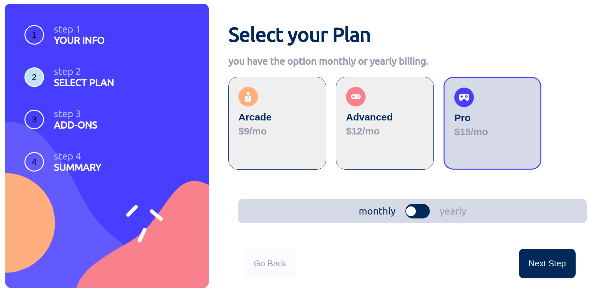

# multi-step-form# Frontend Mentor

This is a solution to the [Multi-step form challenge on Frontend Mentor](https://www.frontendmentor.io/challenges/multistep-form-YVAnSdqQBJ). Frontend Mentor challenges help you improve your coding skills by building realistic projects.

## Table of contents

- [The challenge](#the-challenge)
- [Screenshot](#screenshot)
- [Links](#links)
- [My process](#my-process)
  - [Built with](#built-with)
  - [What I learned](#what-i-learned)
  - [Continued development](#continued-development)
  - [Useful resources](#useful-resources)
- [Author](#author)

### The challenge

The challenge was to validate form ,keep track user selection and put summary after that.

### Screenshot

### Links

- Solution URL: [Add solution URL here](https://github.com/Girma3/multi-step-form)
- Live Site URL: [Add live site URL here](https://your-live-site-url.com)

## My process

### Built with

- Semantic HTML5 markup
- CSS custom properties
- Flexbox
- CSS Grid
- Javascript

### What I learned

Use this section to recap over some of your major learnings while working through this project. Writing these out and providing code samples of areas you want to highlight is a great way to reinforce your own knowledge.

To see how you can add code snippets, see below:
I learned to use constraint api to validate form more,store user selection in object and practice using and creating class to track user changes.

### Continued development

to practice more using class methods and separate dom element from logic,validate form.

### Useful resources

- [resource](https://tutorial.eyehunts.com/js/javascript-class-constructor-default-values-example-code/) - This helped me to set default value when render in html it didn't say undefined.and help me to create tabs in js and render it with out error.
- [resource ](https://regex101.com/) - this site help me to test the reg expression I used to validate form.

## Author

- Frontend Mentor - [(https://www.frontendmentor.io/profile/Girma3)]
